# Instrukcja użytkownika – Portal Kibica Wisły Kraków

Ta instrukcja krok po kroku wyjaśnia, jak korzystać z Portalu Kibica oraz jak zalogować się i zarządzać treściami w panelu administracyjnym. Nie wymaga żadnej wiedzy technicznej.

## 1. Strona główna

Po wejściu na stronę widoczna jest strona główna z najbliższym meczem oraz najnowszymi aktualnościami klubu.

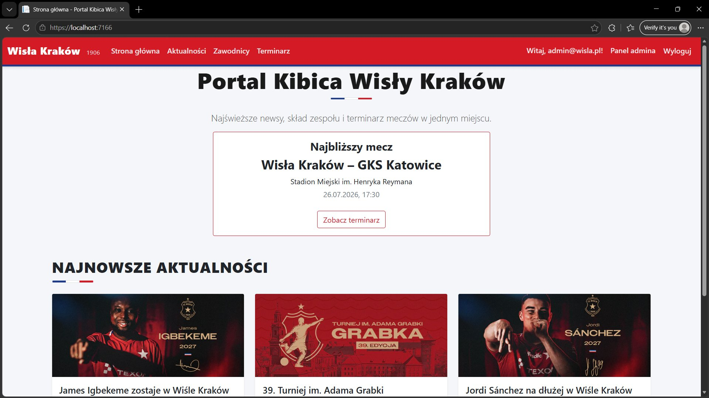

U góry strony znajduje się menu nawigacyjne z zakładkami:

- **Strona główna** – powrót na stronę startową
- **Aktualności** – lista newsów klubowych
- **Zawodnicy** – skład zespołu
- **Terminarz** – nadchodzące i rozegrane mecze

## 2. Aktualności 

Klikając w zakładkę **Aktualności**, użytkownik widzi listę wszystkich newsów. Można też skorzystać z pola wyszukiwania, aby znaleźć news po słowie zawartym w tytule lub treści.

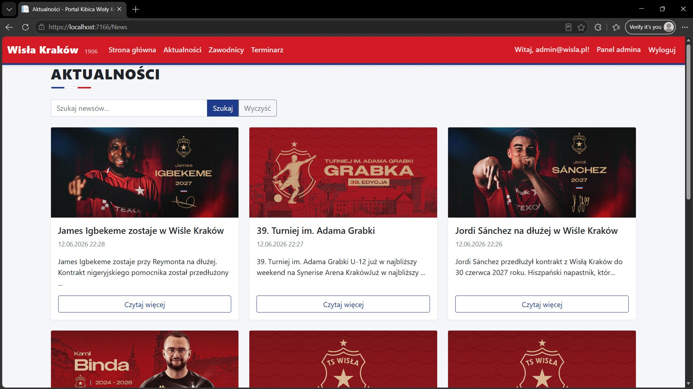

Aby przeczytać cały news, należy kliknąć przycisk **Czytaj więcej** pod wybraną aktualnością.

## 3. Zawodnicy

Zakładka **Zawodnicy** prezentuje skład zespołu podzielony na pozycje (Bramkarz, Obrońca, Pomocnik, Napastnik). Można kliknąć w przyciski filtrów (np. "Bramkarz"), aby wyświetlić tylko zawodników z danej pozycji.

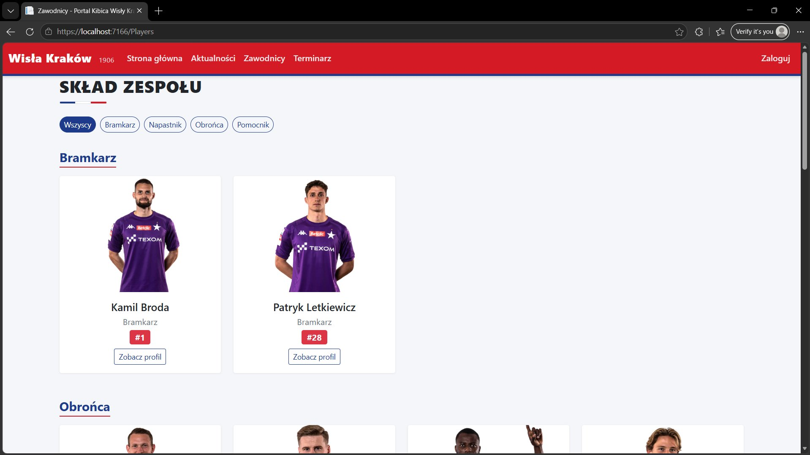

Klikając **Zobacz profil** przy zawodniku, można zobaczyć jego szczegółowy opis i zdjęcie.

## 4. Terminarz

Zakładka **Terminarz** zawiera dwie sekcje: **Najbliższe mecze** (karty z datą i miejscem rozegrania) oraz **Rozegrane mecze** (tabela z wynikami).

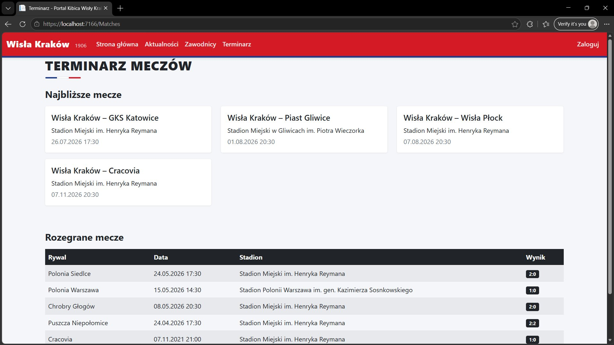

## 5. Logowanie do panelu administracyjnego

Aby zarządzać treściami na stronie (dodawać newsy, zawodników, mecze), należy się zalogować jako administrator.

1. Kliknij przycisk **Zaloguj** w prawym górnym rogu strony.
2. Wypełnij formularz logowania:
   - **Adres e-mail**: `admin@wisla.pl`
   - **Hasło**: `Admin123!`
3. Kliknij **Zaloguj się**.

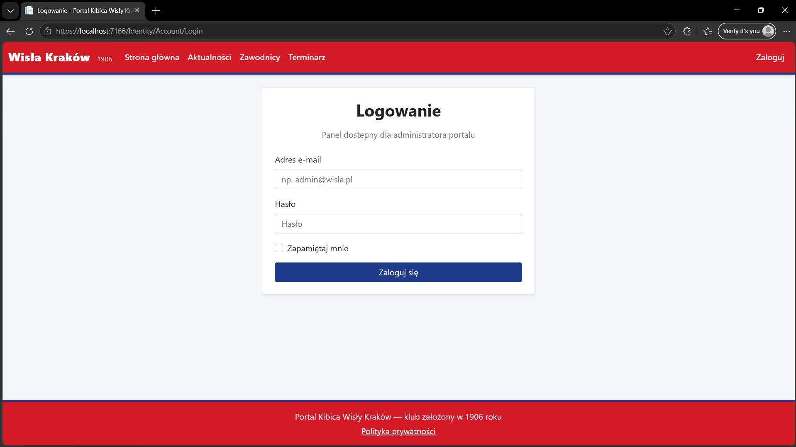

Po zalogowaniu w prawym górnym rogu pojawi się napis "Witaj, admin@wisla.pl!" oraz przyciski **Panel admina** i **Wyloguj**.

## 6. Panel administracyjny – dashboard

Po kliknięciu **Panel admina** użytkownik zostaje przekierowany na stronę panelu administracyjnego. Widoczne są tam trzy kafelki ze statystykami:

- liczba aktualności,
- liczba zawodników,
- liczba meczów w bazie.

Pod każdym kafelkiem znajduje się przycisk **Zarządzaj →**, prowadzący do listy danego typu treści, oraz przycisk **+ Dodaj...**, prowadzący prosto do formularza dodawania nowego wpisu.

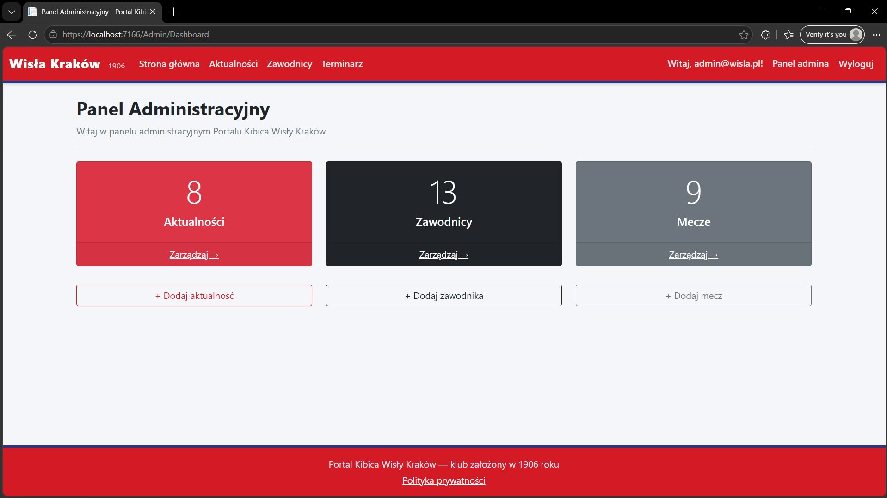

## 7. Zarządzanie aktualnościami

Po kliknięciu **Zarządzaj →** przy kafelku "Aktualności" wyświetla się lista wszystkich newsów z możliwością edycji i usuwania.

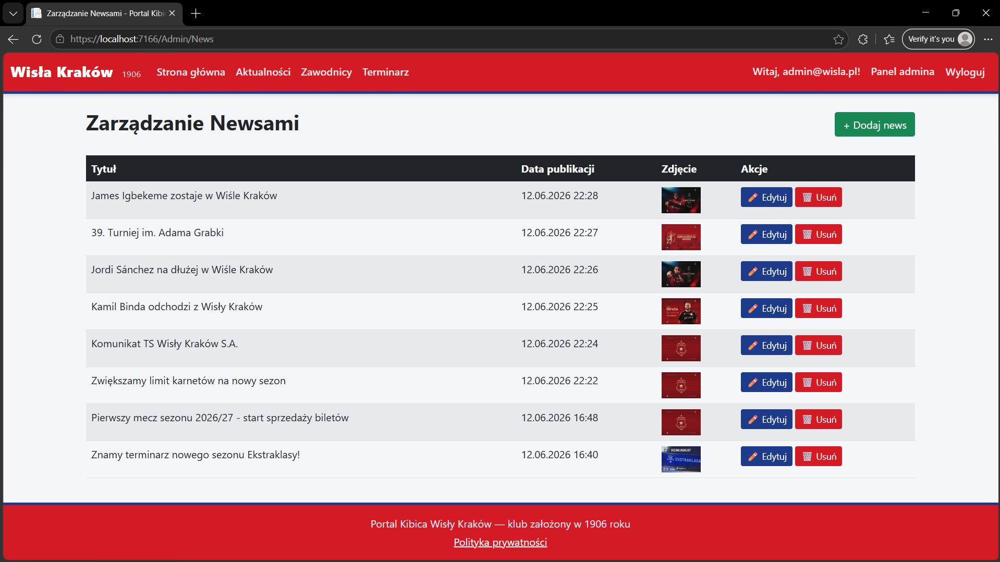

### Dodawanie nowego newsa

1. Kliknij przycisk **+ Dodaj news** w prawym górnym rogu.
2. Wypełnij pola:
   - **Tytuł** – tytuł aktualności
   - **Treść** – treść newsa (pod polem widoczny jest licznik wpisanych znaków)
   - **Zdjęcie (opcjonalne)** – kliknij **Choose File**, aby wybrać obrazek z komputera
3. Kliknij **Zapisz**.

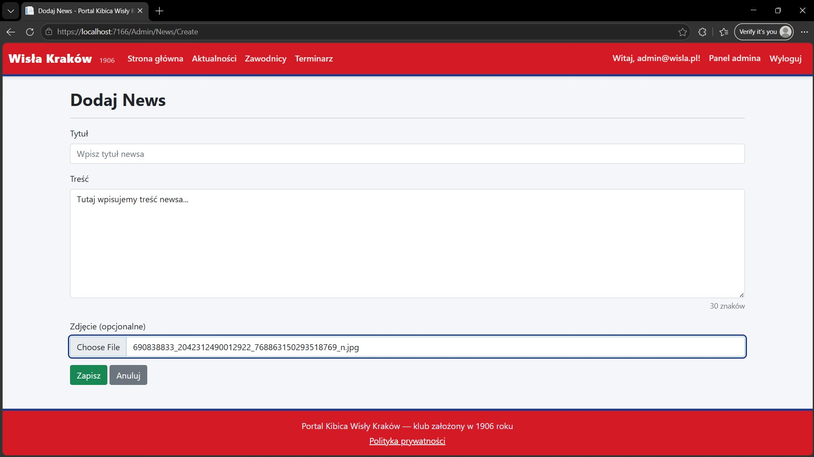

### Edycja i usuwanie newsa

Na liście aktualności przy każdym wpisie znajdują się przyciski:

- **Edytuj** – otwiera formularz edycji z wypełnionymi aktualnymi danymi; po zmianie treści kliknij **Zapisz zmiany**
- **Usuń** – wyświetla ekran potwierdzenia, na którym należy kliknąć **Tak, usuń**, aby trwale usunąć news

## 8. Zarządzanie zawodnikami

Po kliknięciu **Zarządzaj →** przy kafelku "Zawodnicy" wyświetla się lista wszystkich zawodników wraz z numerem, pozycją i zdjęciem.

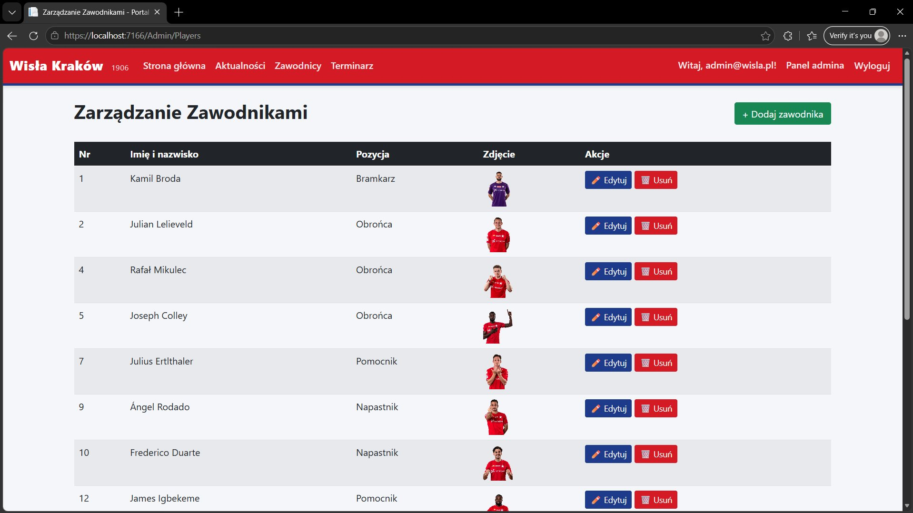

### Dodawanie nowego zawodnika

1. Kliknij przycisk **+ Dodaj zawodnika**.
2. Wypełnij pola:
   - **Imię i nazwisko**
   - **Pozycja** – wybierz z listy rozwijanej (np. Bramkarz, Obrońca, Pomocnik, Napastnik)
   - **Numer** – numer na koszulce
   - **Opis** – krótki opis zawodnika
   - **Zdjęcie** – kliknij **Choose File**, aby wybrać zdjęcie zawodnika
3. Kliknij **Zapisz**.

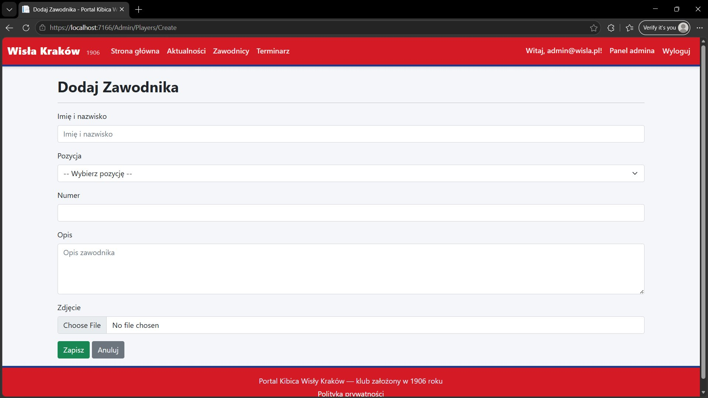

### Edycja i usuwanie zawodnika

Podobnie jak w przypadku newsów, przy każdym zawodniku na liście znajdują się przyciski **Edytuj** i **Usuń**, działające analogicznie.

> **Uwaga:** wartość wpisana w polu "Pozycja" decyduje o tym, w jakiej grupie zawodnik pojawi się na publicznej stronie "Zawodnicy" (np. wszyscy z pozycją "Pomocnik" znajdą się w jednej sekcji). Aby filtrowanie działało poprawnie, warto używać zawsze tych samych nazw pozycji (np. zawsze "Bramkarz", a nie raz "Bramkarz" raz "bramkarz").

## 9. Zarządzanie meczami

Po kliknięciu **Zarządzaj →** przy kafelku "Mecze" wyświetla się lista wszystkich meczów wraz z datą, stadionem i wynikiem (jeśli mecz już się odbył).

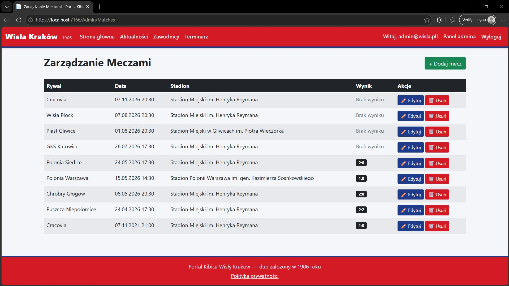

### Dodawanie nowego meczu

1. Kliknij przycisk **+ Dodaj mecz**.
2. Wypełnij pola:
   - **Rywal** – nazwa drużyny przeciwnika
   - **Data meczu** – kliknij w pole i wybierz datę oraz godzinę z kalendarza
   - **Stadion** – nazwa stadionu, na którym odbędzie się mecz
   - **Wynik (opcjonalnie)** – pole należy wypełnić tylko dla meczów, które już się odbyły (np. "2:1"); dla nadchodzących meczów pole pozostaje puste
3. Kliknij **Zapisz**.

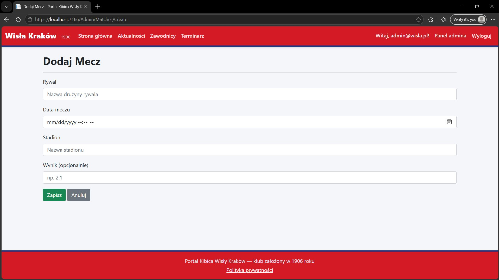

### Edycja i usuwanie meczu

Przy każdym meczu na liście znajdują się przyciski **Edytuj** i **Usuń**, działające analogicznie jak w przypadku newsów i zawodników. Po rozegraniu meczu wystarczy kliknąć **Edytuj** i wpisać wynik w polu "Wynik".

> Mecze z wypełnionym wynikiem oraz datą z przeszłości automatycznie pojawiają się na publicznej stronie "Terminarz" w sekcji "Rozegrane mecze". Mecze z datą w przyszłości i bez wyniku pojawiają się w sekcji "Najbliższe mecze".

## 10. Wylogowanie

Aby się wylogować z panelu administracyjnego, kliknij przycisk **Wyloguj** w prawym górnym rogu strony. Po wylogowaniu dostęp do panelu administracyjnego nie będzie możliwy, a zakładka "Panel admina" przestanie być widoczna – w jej miejscu pojawi się przycisk **Zaloguj**.